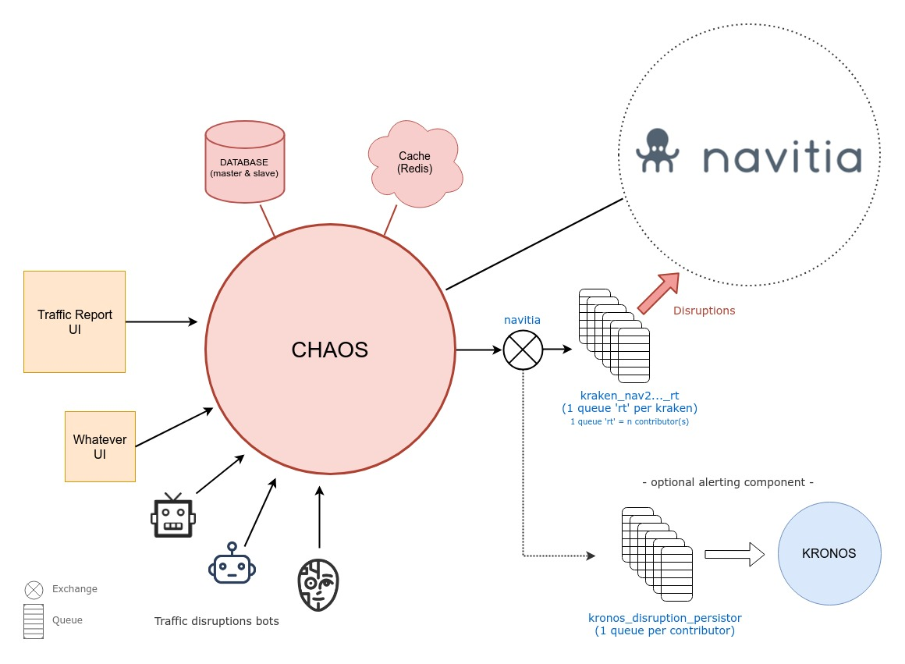

# Chaos
Chaos is the web service which can feed [Navitia](https://github.com/CanalTP/navitia) with real-time [disruptions](http://doc.navitia.io/#traffic-reports).
It can work together with [Kirin](https://github.com/CanalTP/kirin) which can feed [Navitia](https://github.com/CanalTP/navitia) with real-time delays.



## API Documentation

[Swagger](http://petstore.swagger.io/?url=https://raw.githubusercontent.com/CanalTP/Chaos/master/documentation/swagger.yml)

For french users, you can see this [FAQ](documentation/faq_fr.md)

## Installation

### The hard way

#### Clone the Chaos repository
```
git clone git@github.com:CanalTP/Chaos.git
cd Chaos
```

#### Requirements
- PostgreSQL 9.6 `sudo apt-get install postgresql-9.6 postgresql-server-dev-9.6 libpq-dev`
- [RabbitMQ](https://www.rabbitmq.com/download.html)
##### Python
- Install Python2.7 `sudo apt-get install python2.7 python2.7-dev`
  
  or `sudo apt install python2 python2-dev` on recent linux release
- Install [pip](https://pip.pypa.io/en/latest/installing/)
- Install [virtualenv](http://virtualenv.readthedocs.org/en/latest/installation.html)

```
virtualenv venv
source venv/bin/activate
pip install -r requirements.txt
```

#### Build protobufs
- Install protoc building it from source : [protobuf v2.6.1](https://github.com/protocolbuffers/protobuf/releases/download/v2.6.1/protobuf-2.6.1.zip). You can use `sudo apt-get install protobuf-compiler` if you're sure it won't install version 3.x.x (incompatible).
- Build protobufs

```
git submodule init
git submodule update
./setup.py build_pbf
```


#### Create the database
```
sudo -i -u postgres
# Create a user
createuser -P navitia
(password "navitia")

# Create database
createdb -O navitia chaos

# Create database for tests
createdb -O navitia chaos_testing
ctrl + d
```
#### Cache configuration
To improve its performance Chaos can use [Redis](https://redis.io/).

##### Install Redis
[Installing Redis](https://redis.io/topics/quickstart)

##### Using Chaos without Redis
You can deactivate Redis usage in [default_settings.py](https://github.com/CanalTP/Chaos/blob/master/chaos/default_settings.py#L18) by changing 'CACHE_TYPE' to 'simple'

##### Using Chaos without cache
For development purpose you can deactivate cache usage in [default_settings.py](https://github.com/CanalTP/Chaos/blob/master/chaos/default_settings.py#L18) by forcing 'CACHE_TYPE' to 'null'

#### Run Chaos with honcho (optional)
##### Install honcho
You can use [honcho](https://github.com/nickstenning/honcho) for managing Procfile-based applications.

```
pip install honcho
```

##### Upgrade database

```
honcho run ./manage.py db upgrade
```

##### RabbitMQ (optional)
RabbitMQ is optional and you can deactivate it if you don't want to send disruptions to a queue.

```
# chaos/default_settings.py
ENABLE_RABBITMQ = False
```

##### Run Chaos
```
honcho start
```

#### The easy way (with Docker)

```
git clone git@github.com:CanalTP/Chaos.git
cd Chaos
git submodule init
git submodule update
docker-compose up -d
```

To watch logs output: 
```
docker-compose logs -f
``` 

Chaos will be accessible on http://chaos_ws_1.docker if you are using the [docker-gen-hosts tool](https://github.com/vincentlepot/docker-gen-hosts), it will also be accessible on http://chaos-ws.local.canaltp.fr 
The database will be accessible at 'chaos_database_1.docker' and default RabbitMQ interface at 'http://chaos_rabbitmq_1.docker:15672'.

## Security (optional)

If you want to add more security, you can add a file chaos/clients_tokens.json with the client code and navitia tokens like:
```
{
   "client_code": [
     "navitia_token1",
     "navitia_token2"
   ]
 }
```
client_code should be the same as the value of X-Customer-Id header in HTTP request and token should be the same as the value of Authorization header in HTTP request
If the file doesn't exist, the security will be disabled.

You can add a 'master' key in the file. It will allow you to access all resources for all clients.

## Tests

### Unit tests
```
cd tests
honcho run nosetests
```

### Functional tests
```
cd tests
honcho run lettuce
```
To stop directly on faulty test
```
cd tests
honcho run lettuce --failfast
```

### With docker
```
docker-compose -f docker-compose.test.yml build --pull
docker-compose -f docker-compose.test.yml up -d
docker-compose -f docker-compose.test.yml exec -T chaos /bin/sh ./docker/tests.sh
docker-compose -f docker-compose.test.yml down --remove-orphans
```

## Copyright

Copyright © since 2001, Kisio Digital and/or its affiliates. All rights reserved.
This project is part of Navitia surround, the sprawling API to build cool stuff with public transport.

Hope you'll enjoy and contribute to this project, powered by Kisio Digital (www.kisio.com).
    
Help us simplify mobility and open public transport: a non ending quest to the responsive locomotion way of traveling !
   
## Licence

This program is free software; you can redistribute it and/or modify it under the terms of the GNU Affero General Public License as published by
the Free Software Foundation, either version 3 of the License, or (at your option) any later version.
This program is distributed in the hope that it will be useful,
but WITHOUT ANY WARRANTY; without even the implied warranty of
MERCHANTABILITY or FITNESS FOR A PARTICULAR PURPOSE. See the
GNU Affero General Public License for more details.

You should have received a copy of the GNU Affero General Public License
along with this program. If not, see <http://www.gnu.org/licenses/>.

## Stay tuned

[Twitter @navitia](https://twitter.com/navitia)

Tchat channel [`#navitia` on riot](https://riot.im/app/#/room/#navitia:matrix.org)

Forum [Navitia on googlegroups](https://groups.google.com/d/forum/navitia)

www.navitia.io
